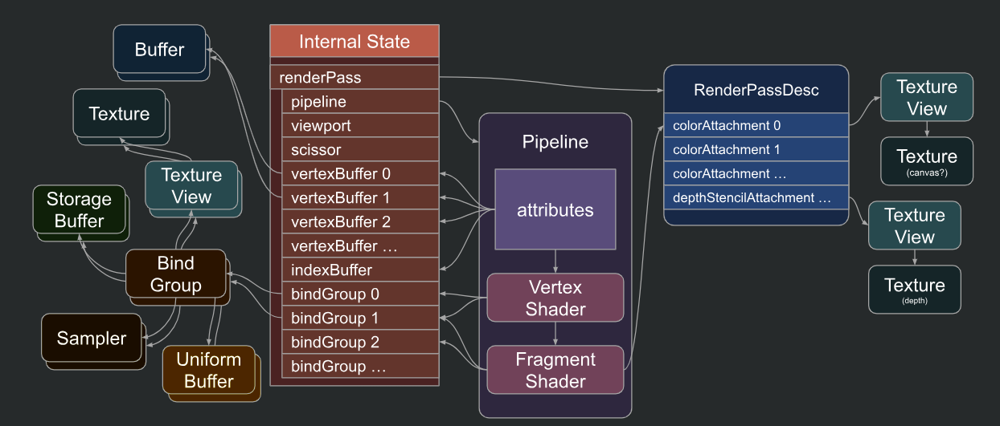

# gpu-accelerated-bevy

wrapper code to remove boilerplate involved with game mechanics, physics engines, collision detection, and other systems typically run on the CPU

# GOALS:

-simplify GPU acceleration so that GPU-specific concepts don't have to be learned: - bind groups, buffers, pipelines, wgsl, etc.

# TODO:

The next major thing to complete before publishing is to move the input/output data metadata specs into the proc macro to be generated automatically without the artificial # limit

### What parts can we abstract out?

- static resources are easiest

- with the power-user version the user supplies their own WGSL file or text and must ensure it is valid

- The results go to a resource that the user can use however they want
- The inputs are provided via a resource
- The whole system timing can be manually configured
- instead of entity population, iteration dimmensionality is specified.
- max num results is calculated via a callback based on dimmension sizes, or can be manually specified with the input data

Each compute task is a component?
All associated resources are other components attached to the same entity?

## API Plan

Add the plugin, can optionally load the power-user or the easy plugin or both
Spawn compute task entities (using required components (like bundles))
These components will continuously run, until stopped
The compute task has an input component that you mutate in order to send it new inputs
WILL NOT RUN AGAIN UNLESS INPUTS ARE CHANGED
You get outputs from its output component

Output types map and input types map for allow for automatic buffer handling

What if they want to run multiple batches in a single frame?
They can spawn multiple identical compute tasks, and send the inputs to each.
